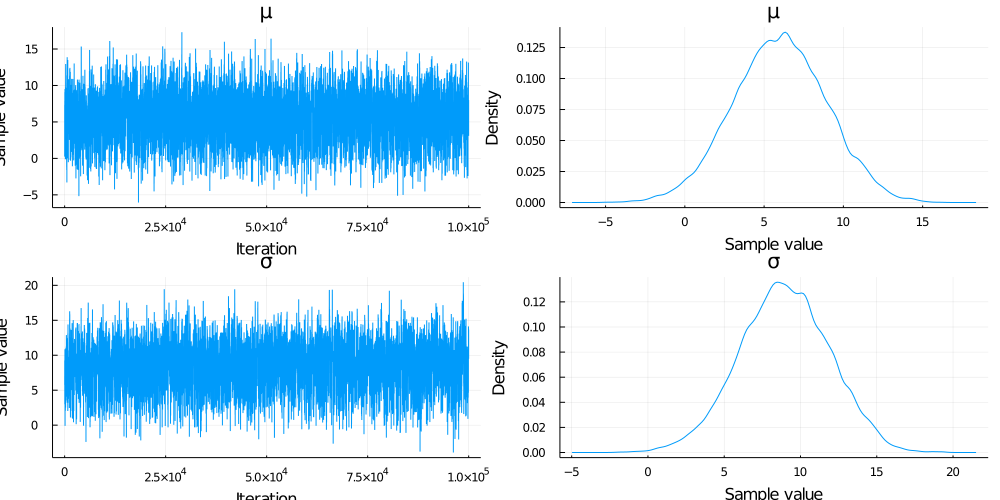
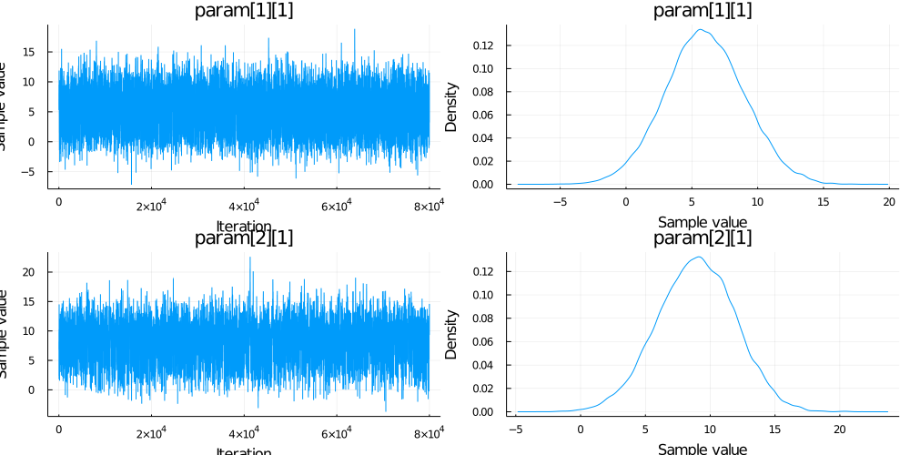

# Comparison with [AdvancedHMC.jl](https://github.com/TuringLang/AdvancedHMC.jl)

### Comparison 1

This example compares the mean of samples generated using **Gibbs** and **AdvancedMH** sampling methods. There is two parameters in this examples with proposal distribution of ` P1 ~ Normal(2.0,3.0)` and `P2 ~  Normal(3.0,3.0)`. Moreover, there is no likelihood function involved in the calculation of log joint probability.
```julia
#use packages
using AdvancedMH
using MCMCChains
using GibbsSampler
using Distributions
using StatsPlots

#define prior and proposal distributions
proposal = [Normal(2.0,3.0), Normal(3.0,3.0)]
priors = proposal

#log of joint probability
function logJoint(params)	
	logPrior= sum(logpdf.(priors, params))
	return logPrior
end

# Construct a DensityModel for advanced MH.
mdl = DensityModel(logJoint)

# Set up our sampler with a joint multivariate Normal proposal for advanced MH.
spl = RWMH(MvNormal([2.0,3.0],3.0))

# Sample from the posterior using Advanced MH.
chm = sample(mdl, spl, 100000; param_names=["μ", "σ"], chain_type=Chains)


# Sample from the posterior using Gibbs sampler.
chn = GibbsSampler.gibbs(proposal, logJoint;itr = 100000, chain_type = :mcmcchain)

```

The results are as below:

```julia
plot(chm)
```

```julia
plot(chn)
```


### Comparison 2

The only difference from the **Example1** is the introduction likelihood function to calculate the joint probability.

```julia
#Define  the prior and proposal distribution
proposal = [Normal(1.0,5.0), Normal(0.0,5.0)]
priors = proposal

#Define the model
model(z) = z[1] + z[2]
output = 5.0

#Function to calculate log joint probability
function logJoint1(params)	
	logPrior= sum(logpdf.(priors, params))
	logLikelihood = logpdf(Normal(model(params)), output)
	return logPrior + logLikelihood
end

# Construct a DensityModel for advanced MH.
mdl1 = DensityModel(logJoint1)

# Set up our sampler with a joint multivariate Normal proposal for advanced MH.
spl1 = RWMH(MvNormal([1.0,0.0],5.0))

# Sample from the posterior using advanced MH.
chm = sample(mdl1, spl1, 100000; param_names=["μ", "σ"], chain_type=Chains)

# Sample from the posterior using Gibbs Sampler.
chn = GibbsSampler.gibbs(proposal, logJoint1;itr = 100000)

@show mean(Array(chn[1,2:end])) mean(chm[:μ])
```

The results are as below:
```julia
mean(Array(chn[1, 2:end])) = 3.9480667426375584
mean(chm[:μ]) = 4.073099811056996

```
